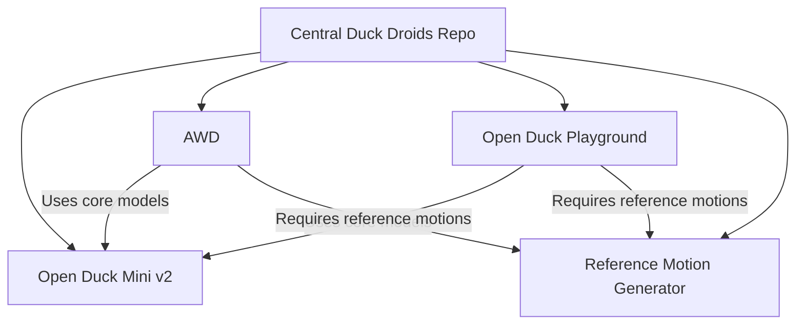

# Behold-Urwar Droid Concepts

An all-in one place for information and creation of BD class droids from Behold-Urwar Droid Concepts.

## Why the Name?
Learn more about the inspiration behind our project at:
[Behold-Urwar Droid Concepts on Fandom](https://starwars.fandom.com/wiki/Behold-Urwar_Droid_Concepts)

## Project Structure

This repository centralizes various Duck Droids projects into one cohesive hub. The structure is as follows:

```
central-duck-droids/
├── docs/
│   └── architecture.mermaid      # Mermaid diagram showing project relationships
├── submodules/
│   ├── open_duck_mini_v2/         # Open Duck Mini v2
│   ├── AWD/                     # AWD
│   ├── open_duck_playground/     # Open Duck Playground
│   └── reference_motion/         # Reference Motion Generator
└── README.md                     # This file
```

## Architecture Diagram



## Prerequisites

- **Git:** Ensure Git is installed.
- **Python:** Version 3.7+ is recommended.
- **Additional Dependencies:** Each submodule may have its own requirements. Please check their respective README files.
- **Optional Tools:** [uv](https://astral.sh/uv) is used in some submodules (Playground & Reference Motion Generator).

## Getting Started

### Cloning the Repository

Clone this repository along with all submodules:

```bash
git clone --recursive https://github.com/your-username/central-duck-droids.git
cd central-duck-droids
```

If you cloned without the `--recursive` flag, initialize the submodules:

```bash
git submodule update --init --recursive
```

### Working with Each Component

1. **Open Duck Mini v2**  
   This submodule hosts the core duck droid model.
   
   ```bash
   cd submodules/open_duck_mini_v2
   # Ensure you're on the correct branch (v2)
   git checkout v2
   ```

2. **AWD (Adversarial Waddle Dynamics)**  
   Provides the training framework using AMP for duck droid control.
   
   ```bash
   cd ../AWD
   pip install -r requirements.txt
   # Refer to the AWD README for specific training commands, for example:
   # python awd/run.py --task DucklingCommand --num_envs <num> --cfg_env awd/data/cfg/<robot>/duckling_command.yaml --cfg_train awd/data/cfg/<robot>/train/amp_duckling_task.yaml --motion_file awd/data/motions/<robot>/
   ```

3. **Open Duck Playground**  
   Contains Mujoco-based RL environments.
   
   ```bash
   cd ../open_duck_playground
   # Install dependencies and follow usage instructions from its README, for example:
   # uv run playground/<robot>/runner.py
   ```

4. **Reference Motion Generator**  
   Generates reference motions for imitation learning.
   
   ```bash
   cd ../reference_motion
   # Install dependencies and run scripts as per the repository's instructions, for example:
   # uv run scripts/auto_waddle.py --duck ["go_bdx", "open_duck_mini", "open_duck_mini_v2"] --output_dir <your_output_directory>
   ```

## Centralized Workflow

Utilize the documentation in the `docs/` folder (especially `architecture.mermaid`) to understand how the projects interconnect.

## Updating Submodules

To update submodules to their latest remote commits:

```bash
git submodule update --remote --merge
```

Then commit the updated submodule pointers:

```bash
git add submodules/*
git commit -m "Updated submodules"
```

## Contributing

- For contribution guidelines, refer to each submodule’s README.
- For issues involving integration between projects, please open an issue in this repository.

## License

Please refer to the individual LICENSE files in each submodule for licensing information.

---

Happy ducking and welcome to the team! For any questions or issues, feel free to reach out.
