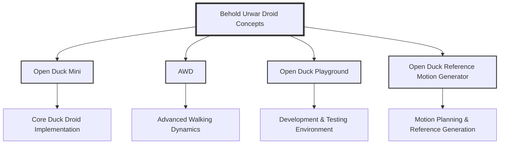

# Behold Urwar Droid Concepts

A centralized repository for Duck Droid projects and related tools.

## Repository Structure



## Project Components

- **Open Duck Mini**: Core implementation of the Duck Droid
- **AWD**: Advanced Walking Dynamics implementation
- **Open Duck Playground**: Development and testing environment
- **Open Duck Reference Motion Generator**: Tools for motion planning and reference generation

## Quick Start

1. Clone this repository:
   ```bash
   git clone https://github.com/yourusername/Behold-Urwar-Droid-Concepts.git
   cd Behold-Urwar-Droid-Concepts
   ```

2. Initialize and update submodules:
   ```bash
   git submodule update --init --recursive
   ```

3. Run the setup script:
   ```bash
   ./setup.sh
   ```

4. Launch the page:
   ```bash
   python app.py
   ```

### Webpage preview


## Development

Each component is maintained as a git submodule, allowing for independent development while keeping everything organized in one place.

### Directory Structure

```
Behold-Urwar-Droid-Concepts/
├── submodules/
│   ├── open_duck_mini/          # Core Duck Droid implementation
│   ├── awd/                     # Advanced Walking Dynamics
│   ├── open_duck_playground/    # Development environment
│   └── open_duck_reference_motion_generator/  # Motion planning tools
├── docs/                        # Documentation
├── setup.sh                     # Setup script
└── README.md                    # This file
```

## Contributing

1. Fork the repository
2. Create a feature branch
3. Commit your changes
4. Push to the branch
5. Create a Pull Request

## License

Apache 2.0
