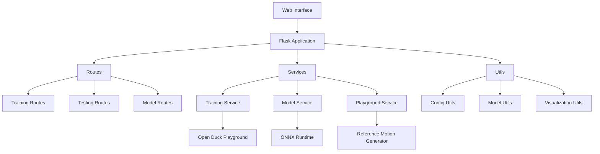

# Behold-Urwar-Droid-Concepts

A modern web interface for training and testing duck droid models using reinforcement learning, built with Flask and UV.

## Architecture



## Features

- Generate reference motions using Placo
- Train policies using imitation learning
- Test trained models in a playground environment
- Export models to ONNX format
- Visualize results in 3D

## Prerequisites

- Python 3.11 or higher
- Git
- CUDA-capable GPU (recommended for training)
- UV package manager

## Installation

### 1. Install UV

First, install UV (a fast Python package installer and resolver):

```bash
curl -LsSf https://astral.sh/uv/install.sh | sh
```

### 2. Clone and Setup

```bash
# Clone the repository

git clone https://github.com/Aronnaxx/Behold-Urwar-Droid-Concepts.git
cd Behold-Urwar-Droid-Concepts

# Initialize and update submodules
git submodule update --init --recursive
```

## Running the Application

1. Start the web interface:
```bash
uv python pin 3.11
uv run app.py
```

2. Open your browser and navigate to:
```
http://localhost:5002
```

## Project Structure

```
.
├── app/                    # Core application code
│   ├── config/           # Configuration files
│   ├── routes/           # Flask routes
│   ├── services/         # Business logic
│   ├── static/          # Static assets
│   ├── templates/       # HTML templates
│   └── utils/           # Utility functions
├── submodules/          # Git submodules
│   ├── open_duck_mini/  # Duck model definitions
│   ├── open_duck_playground/  # Training environment
│   └── open_duck_reference_motion_generator/  # Motion generation
├── output/              # Generated outputs
├── .env                # Environment configuration
├── app.py             # Main Flask application
├── pyproject.toml     # Python package configuration
└── uv.lock           # UV dependency lock file
```

## Development

### Code Style

This project uses:
- Black for code formatting
- isort for import sorting
- flake8 for linting

Run the formatters:
```bash
black .
isort .
```

### Running Tests

```bash
pytest
```

## License

MIT License - see LICENSE file for details
