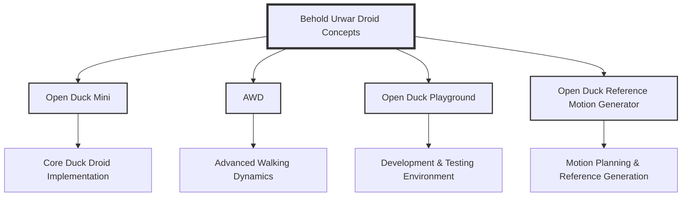

# Behold Urwar Droid Concepts

A centralized repository for Duck Droid projects and related tools.

## Repository Structure



## Project Components

- **Open Duck Mini**: Core implementation of the Duck Droid
- **AWD**: Advanced Walking Dynamics implementation
- **Open Duck Playground**: Development and testing environment
- **Open Duck Reference Motion Generator**: Tools for motion planning and reference generation

## Project Structure

```
Behold-Urwar-Droid-Concepts/
├── app/                    # Main application package
│   ├── routes/            # Route handlers
│   ├── services/          # Business logic
│   ├── utils/             # Utility functions
│   └── config.py          # Configuration
├── docs/                  # Documentation
│   └── learning/          # Learning center content
├── submodules/            # Git submodules
│   ├── open_duck_mini/    # Core Duck Droid implementation
│   ├── awd/               # Advanced Walking Dynamics
│   ├── open_duck_playground/  # Development environment
│   └── open_duck_reference_motion_generator/  # Motion planning tools
├── static/                # Static assets
├── templates/             # HTML templates
└── scripts/              # Utility scripts
```

## Quick Start

1. Clone this repository:
   ```bash
   git clone https://github.com/yourusername/Behold-Urwar-Droid-Concepts.git
   cd Behold-Urwar-Droid-Concepts
   ```

2. Initialize and update submodules:
   ```bash
   git submodule update --init --recursive
   ```

3. Run the setup script:
   ```bash
   ./setup.sh
   ```

4. Launch the application:
   ```bash
   python app.py
   ```
## Learning Center

The project includes a comprehensive learning center with documentation for each component:

- [Motion Generation](docs/learning/motion_generation/README.md)
- [Training Process](docs/learning/training/README.md)
- [Mujoco Playground](docs/learning/playground/README.md)
- [Advanced Walking Dynamics](docs/learning/awd/README.md)

## Development

Each component is maintained as a git submodule, allowing for independent development while keeping everything organized in one place.

### Adding New Features

1. Create a new branch for your feature
2. Make changes in the appropriate submodule
3. Update the main application if needed
4. Add documentation in the learning center
5. Create a pull request

## Contributing

1. Fork the repository
2. Create a feature branch
3. Commit your changes
4. Push to the branch
5. Create a Pull Request

## License

Apache 2.0
