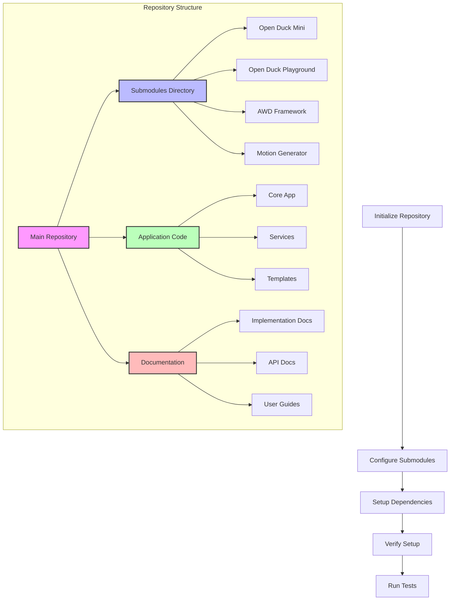

# Repository Setup and Structure

## System Flow


## Overview
This document details the setup and structure for the Behold-Urwar-Droid-Concepts (BUDC) repository. It covers directory organization, submodule management, and environment setup.

## Directory Structure
```
.
├── app/                    # Core application code
├── docs/                   # Documentation
├── generated_motions/      # Storage for generated reference motions
├── static/                 # Static assets (CSS, JS, images)
├── submodules/            # Git submodules
├── templates/             # Flask HTML templates
├── trained_models/        # Storage for trained ONNX models
├── .env                   # Environment configuration
├── app.py                 # Main Flask application
├── requirements.txt       # Python dependencies
└── setup.sh              # Setup automation script
```

## Setup Instructions

### 1. Initial Repository Setup
```bash
# Clone the repository
git clone https://github.com/Aronnaxx/Behold-Urwar-Droid-Concepts.git
cd Behold-Urwar-Droid-Concepts

# Create necessary directories
mkdir -p app static templates docs generated_motions trained_models
```

### 2. Submodule Configuration
```bash
# Initialize submodules directory
mkdir -p submodules
cd submodules

# Add required submodules
git submodule add https://github.com/apirrone/Open_Duck_Mini.git
git submodule add https://github.com/apirrone/Open_Duck_Playground.git
git submodule add https://github.com/rimim/AWD.git
git submodule add https://github.com/apirrone/Open_Duck_reference_motion_generator.git

# Initialize and update all submodules
git submodule update --init --recursive
```

### 3. Python Environment Setup

#### Virtual Environment
```bash
# Create virtual environment
python -m venv .venv

# Activate virtual environment
# On Unix/macOS:
source .venv/bin/activate
# On Windows:
.venv\Scripts\activate
```

#### Dependencies
Create a `requirements.txt` with necessary packages:
```
flask>=2.0.1
paramiko>=2.8.1
onnxruntime>=1.10.0
numpy>=1.21.0
opencv-python>=4.5.3
pytorch>=1.9.0
pyyaml>=5.4.1
```

Install dependencies:
```bash
pip install -r requirements.txt
```

### 4. Configuration Files

#### .env Template
```env
# Flask Configuration
FLASK_APP=app.py
FLASK_ENV=development
SECRET_KEY=your-secret-key-here

# Jetson Configuration
JETSON_IP=192.168.1.10
JETSON_USER=jetson
JETSON_PASSWORD=password

# Training Configuration
TRAINING_EPOCHS=10
LEARNING_RATE=0.001
BATCH_SIZE=32
```

#### .gitignore Configuration
```gitignore
# Python
__pycache__/
*.py[cod]
*$py.class
.venv/

# Environment
.env
.env.*

# Generated files
generated_motions/*
trained_models/*
!generated_motions/.gitkeep
!trained_models/.gitkeep

# IDE
.vscode/
.idea/

# Logs
*.log
```

### 5. Setup Automation
Create `setup.sh`:
```bash
#!/bin/bash

# Create virtual environment
python -m venv .venv

# Activate virtual environment
source .venv/bin/activate

# Install dependencies
pip install -r requirements.txt

# Initialize submodules
git submodule update --init --recursive

# Create necessary directories
mkdir -p app static templates docs generated_motions trained_models

# Create .env if it doesn't exist
if [ ! -f .env ]; then
    cp .env.example .env
fi

# Set proper permissions
chmod +x setup.sh

echo "Setup complete! Don't forget to:"
echo "1. Configure your .env file"
echo "2. Activate the virtual environment: source .venv/bin/activate"
```

## Verification Steps

1. **Directory Structure**
```bash
# Verify directories were created
ls -la
```
