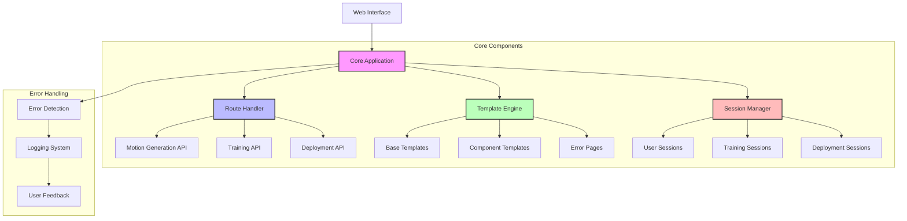

# Core Application Structure

## System Flow


## Overview
This document details the core Flask application structure for BUDC, including routing, templates, error handling, and session management.

## Application Structure
```
app/
├── __init__.py           # Application factory
├── config.py            # Configuration management
├── routes/
│   ├── __init__.py
│   ├── motion.py        # Motion generation routes
│   ├── training.py      # Training routes
│   ├── deployment.py    # Deployment routes
│   └── playground.py    # Playground routes
├── models/
│   ├── __init__.py
│   └── user.py         # User model
├── services/
│   ├── __init__.py
│   ├── motion.py       # Motion generation service
│   ├── training.py     # Training service
│   └── deployment.py   # Deployment service
└── utils/
    ├── __init__.py
    ├── logging.py      # Logging configuration
    └── security.py     # Security utilities
```

## Implementation Steps

### 1. Application Factory (`app/__init__.py`)
```python
from flask import Flask
from flask_sqlalchemy import SQLAlchemy
from flask_login import LoginManager
from .config import Config

db = SQLAlchemy()
login_manager = LoginManager()

def create_app(config_class=Config):
    app = Flask(__name__)
    app.config.from_object(config_class)

    # Initialize extensions
    db.init_app(app)
    login_manager.init_app(app)

    # Register blueprints
    from .routes import motion, training, deployment, playground
    app.register_blueprint(motion.bp)
    app.register_blueprint(training.bp)
    app.register_blueprint(deployment.bp)
    app.register_blueprint(playground.bp)

    # Register error handlers
    @app.errorhandler(404)
    def not_found_error(error):
        return render_template('errors/404.html'), 404

    @app.errorhandler(500)
    def internal_error(error):
        db.session.rollback()
        return render_template('errors/500.html'), 500

    return app
```

### 2. Configuration Management (`app/config.py`)
```python
import os
from dotenv import load_dotenv

basedir = os.path.abspath(os.path.dirname(__file__))
load_dotenv(os.path.join(basedir, '.env'))

class Config:
    SECRET_KEY = os.environ.get('SECRET_KEY') or 'dev-key-please-change'
    SQLALCHEMY_DATABASE_URI = os.environ.get('DATABASE_URL') or \
        'sqlite:///' + os.path.join(basedir, 'app.db')
    SQLALCHEMY_TRACK_MODIFICATIONS = False
    
    # Custom configuration
    MOTION_OUTPUT_DIR = os.path.join(basedir, 'generated_motions')
    MODEL_OUTPUT_DIR = os.path.join(basedir, 'trained_models')
    ALLOWED_EXTENSIONS = {'onnx', 'pth'}
```

### 3. Route Implementation Example (`app/routes/motion.py`)
```python
from flask import Blueprint, render_template, request, jsonify
from app.services.motion import MotionService

bp = Blueprint('motion', __name__, url_prefix='/motion')

@bp.route('/generate', methods=['POST'])
def generate_motion():
    try:
        params = request.get_json()
        motion_service = MotionService()
        result = motion_service.generate(params)
        return jsonify(result)
    except Exception as e:
        return jsonify({'error': str(e)}), 500

@bp.route('/list', methods=['GET'])
def list_motions():
    try:
        motion_service = MotionService()
        motions = motion_service.list_all()
        return jsonify(motions)
    except Exception as e:
        return jsonify({'error': str(e)}), 500
```

### 4. Service Layer Example (`app/services/motion.py`)
```python
import os
from app.config import Config

class MotionService:
    def __init__(self):
        self.output_dir = Config.MOTION_OUTPUT_DIR

    def generate(self, params):
        # Implementation for motion generation
        pass

    def list_all(self):
        # List all generated motions
        motions = []
        for filename in os.listdir(self.output_dir):
            if filename.endswith('.motion'):
                motions.append({
                    'name': filename,
                    'path': os.path.join(self.output_dir, filename)
                })
        return motions
```

### 5. Template Structure
```
templates/
├── base.html           # Base template with common elements
├── errors/
│   ├── 404.html
│   └── 500.html
├── motion/
│   ├── generate.html
│   └── list.html
├── training/
│   ├── configure.html
│   └── monitor.html
└── macros/
    └── forms.html     # Common form macros
```

Example base template (`templates/base.html`):
```html
<!DOCTYPE html>
<html lang="en">
<head>
    <meta charset="UTF-8">
    <meta name="viewport" content="width=device-width, initial-scale=1.0">
    <title> - BUDC</title>
    <link rel="stylesheet" href="{{ url_for('static', filename='css/style.css') }}">
</head>
<body>
    <nav>
        <!-- Navigation content -->
    </nav>
    
    <main>
        
            
                
                    <div class="flash">{{ message }}</div>
                
            
        
        
        
    </main>
    
    <footer>
        <!-- Footer content -->
    </footer>
    
    <script src="{{ url_for('static', filename='js/main.js') }}"></script>
    
</body>
</html>
```

## Error Handling and Logging

### Logging Configuration (`app/utils/logging.py`)
```python
import logging
from logging.handlers import RotatingFileHandler
import os

def setup_logging(app):
    if not os.path.exists('logs'):
        os.mkdir('logs')
    
    file_handler = RotatingFileHandler(
        'logs/budc.log',
        maxBytes=10240,
        backupCount=10
    )
    
    file_handler.setFormatter(logging.Formatter(
        '%(asctime)s %(levelname)s: %(message)s '
        '[in %(pathname)s:%(lineno)d]'
    ))
    
    file_handler.setLevel(logging.INFO)
    app.logger.addHandler(file_handler)
    app.logger.setLevel(logging.INFO)
    app.logger.info('BUDC startup')
```

## Session Management

### User Session Handling (`app/utils/security.py`)
```python
from functools import wraps
from flask import session, redirect, url_for
from flask_login import current_user

def login_required(f):
    @wraps(f)
    def decorated_function(*args, **kwargs):
        if not current_user.is_authenticated:
            return redirect(url_for('auth.login'))
        return f(*args, **kwargs)
    return decorated_function

def requires_permissions(permission):
    def decorator(f):
        @wraps(f)
        def decorated_function(*args, **kwargs):
            if not current_user.has_permission(permission):
                abort(403)
            return f(*args, **kwargs)
        return decorated_function
    return decorator
```

## Testing

Create `tests/` directory with test files:
```
tests/
├── conftest.py           # Test configuration
├── test_motion.py        # Motion generation tests
├── test_training.py      # Training pipeline tests
└── test_deployment.py    # Deployment tests
```

Example test file (`tests/test_motion.py`):
```python
import pytest
from app import create_app
from app.config import Config

class TestConfig(Config):
    TESTING = True
    SQLALCHEMY_DATABASE_URI = 'sqlite://'

@pytest.fixture
def client():
    app = create_app(TestConfig)
    with app.test_client() as client:
        yield client

def test_generate_motion(client):
    response = client.post('/motion/generate', json={
        'type': 'walk',
        'duration': 10
    })
    assert response.status_code == 200
    assert 'motion_id' in response.json
```

## Security Considerations

1. **CSRF Protection**
   - Enable Flask-WTF CSRF protection
   - Include CSRF tokens in forms

2. **XSS Prevention**
   - Use `{{ }}` for template variables
   - Enable Content Security Policy headers

3. **Rate Limiting**
   - Implement rate limiting for API endpoints
   - Use Flask-Limiter

4. **Input Validation**
   - Validate all form inputs
   - Sanitize file uploads

## Next Steps

1. Implement user authentication
2. Set up database migrations
3. Add API documentation
4. Configure production deployment 
