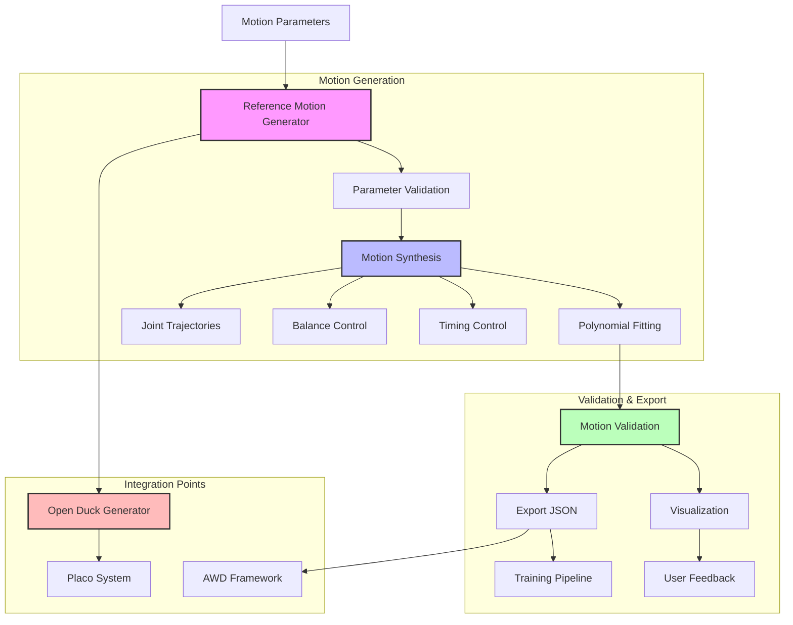

# Reference Motion Generation System

## System Flow


## Overview
This document details the implementation of the reference motion generation system, which integrates with the Open_Duck_reference_motion_generator to create and manage motion patterns for the Duck Droid.

## System Architecture
```
app/
├── services/
│   └── motion/
│       ├── __init__.py
│       ├── generator.py     # Motion generation logic
│       ├── validator.py     # Motion validation
│       └── converter.py     # Format conversion utilities
├── models/
│   └── motion/
│       ├── __init__.py
│       └── reference.py     # Reference motion model
└── templates/
    └── motion/
        ├── generate.html    # Motion generation interface
        └── viewer.html      # Motion preview interface
```

## Implementation Details

### 1. Motion Generator Service (`app/services/motion/generator.py`)
```python
import numpy as np
from pathlib import Path
from app.config import Config
from app.utils.logging import get_logger

logger = get_logger(__name__)

class MotionGenerator:
    def __init__(self):
        self.output_dir = Path(Config.MOTION_OUTPUT_DIR)
        self.output_dir.mkdir(exist_ok=True)
        
    def generate_walk_motion(self, params):
        """Generate walking motion pattern.
        
        Args:
            params (dict): Motion parameters including:
                - speed (float): Walking speed in m/s
                - duration (float): Motion duration in seconds
                - stride_length (float): Length of each stride
        
        Returns:
            str: Path to generated motion file
        """
        try:
            # Implementation using Open_Duck_reference_motion_generator
            from open_duck_reference_motion_generator import WalkMotionGenerator
            
            generator = WalkMotionGenerator(
                speed=params['speed'],
                stride_length=params['stride_length']
            )
            
            motion_data = generator.generate(
                duration=params['duration']
            )
            
            # Save motion data
            output_path = self.output_dir / f"walk_{int(time.time())}.motion"
            np.save(output_path, motion_data)
            
            logger.info(f"Generated walk motion: {output_path}")
            return str(output_path)
            
        except Exception as e:
            logger.error(f"Failed to generate walk motion: {str(e)}")
            raise
            
    def generate_custom_motion(self, params):
        """Generate custom motion pattern.
        
        Args:
            params (dict): Custom motion parameters
        
        Returns:
            str: Path to generated motion file
        """
        # Implementation for custom motion generation
        pass
```

### 2. Motion Validation (`app/services/motion/validator.py`)
```python
import numpy as np
from app.utils.logging import get_logger

logger = get_logger(__name__)

class MotionValidator:
    def __init__(self):
        self.joint_limits = {
            'hip_pitch': (-45, 45),    # degrees
            'knee': (0, 90),           # degrees
            'ankle': (-30, 30)         # degrees
        }
        
    def validate_motion_data(self, motion_data):
        """Validate motion data against physical constraints.
        
        Args:
            motion_data (np.ndarray): Motion data array
            
        Returns:
            tuple: (is_valid, list of violations)
        """
        violations = []
        
        # Check joint limits
        for joint, (min_angle, max_angle) in self.joint_limits.items():
            joint_data = motion_data[f"{joint}_angle"]
            if np.any(joint_data < min_angle) or np.any(joint_data > max_angle):
                violations.append(f"{joint} exceeds angle limits")
                
        # Check motion smoothness
        acceleration = np.diff(motion_data, n=2, axis=0)
        if np.any(np.abs(acceleration) > 1000):  # threshold in deg/s²
            violations.append("Motion acceleration too high")
            
        return len(violations) == 0, violations
```

### 3. Motion Model (`app/models/motion/reference.py`)
```python
from datetime import datetime
from app import db

class ReferenceMotion(db.Model):
    id = db.Column(db.Integer, primary_key=True)
    name = db.Column(db.String(64), index=True)
    type = db.Column(db.String(32))  # walk, run, custom, etc.
    file_path = db.Column(db.String(256))
    created_at = db.Column(db.DateTime, default=datetime.utcnow)
    parameters = db.Column(db.JSON)
    
    def to_dict(self):
        return {
            'id': self.id,
            'name': self.name,
            'type': self.type,
            'file_path': self.file_path,
            'created_at': self.created_at.isoformat(),
            'parameters': self.parameters
        }
```

### 4. Motion Generation Interface (`templates/motion/generate.html`)
```html



<div class="motion-generator">
    <h2>Generate Reference Motion</h2>
    
    <form id="motion-form" class="motion-form">
        <div class="form-group">
            <label for="motion-type">Motion Type</label>
            <select id="motion-type" name="type" required>
                <option value="walk">Walking</option>
                <option value="custom">Custom</option>
            </select>
        </div>
        
        <div id="walk-params" class="motion-params">
            <div class="form-group">
                <label for="speed">Speed (m/s)</label>
                <input type="number" id="speed" name="speed" 
                       min="0.1" max="2.0" step="0.1" value="0.5">
            </div>
            
            <div class="form-group">
                <label for="duration">Duration (s)</label>
                <input type="number" id="duration" name="duration"
                       min="1" max="60" step="1" value="10">
            </div>
            
            <div class="form-group">
                <label for="stride-length">Stride Length (m)</label>
                <input type="number" id="stride-length" name="stride_length"
                       min="0.1" max="0.5" step="0.05" value="0.2">
            </div>
        </div>
        
        <button type="submit" class="btn btn-primary">Generate Motion</button>
    </form>
    
    <div id="preview" class="motion-preview">
        <!-- Motion preview will be rendered here -->
    </div>
</div>




<script src="{{ url_for('static', filename='js/motion-generator.js') }}"></script>

```

### 5. Motion Generation API Routes (`app/routes/motion.py`)
```python
from flask import Blueprint, request, jsonify
from app.services.motion import MotionGenerator, MotionValidator
from app.models.motion import ReferenceMotion
from app import db

bp = Blueprint('motion', __name__, url_prefix='/motion')

@bp.route('/generate', methods=['POST'])
def generate_motion():
    try:
        params = request.get_json()
        
        # Initialize services
        generator = MotionGenerator()
        validator = MotionValidator()
        
        # Generate motion based on type
        if params['type'] == 'walk':
            motion_path = generator.generate_walk_motion(params)
        else:
            motion_path = generator.generate_custom_motion(params)
            
        # Validate generated motion
        motion_data = np.load(motion_path)
        is_valid, violations = validator.validate_motion_data(motion_data)
        
        if not is_valid:
            return jsonify({
                'error': 'Invalid motion generated',
                'violations': violations
            }), 400
            
        # Save to database
        motion = ReferenceMotion(
            name=f"{params['type']}_{int(time.time())}",
            type=params['type'],
            file_path=motion_path,
            parameters=params
        )
        db.session.add(motion)
        db.session.commit()
        
        return jsonify(motion.to_dict())
        
    except Exception as e:
        return jsonify({'error': str(e)}), 500
```

## Motion File Format

Reference motions are stored in `.motion` files with the following structure:
```python
{
    'joint_angles': np.ndarray,  # Shape: (n_timesteps, n_joints)
    'timestamps': np.ndarray,    # Shape: (n_timesteps,)
    'metadata': {
        'type': str,            # Motion type
        'parameters': dict,     # Generation parameters
        'created_at': str       # ISO format timestamp
    }
}
```

## Integration with Open_Duck_reference_motion_generator

1. **Submodule Setup**
```bash
cd submodules
git submodule add https://github.com/apirrone/Open_Duck_reference_motion_generator.git
```

2. **Python Path Configuration**
```python
import sys
from pathlib import Path

# Add submodule to Python path
motion_generator_path = Path(__file__).parent.parent / 'submodules' / 'Open_Duck_reference_motion_generator'
sys.path.append(str(motion_generator_path))
```

## Testing

Create test files in `tests/motion/`:
```python
import pytest
import numpy as np
from app.services.motion import MotionGenerator, MotionValidator

def test_walk_motion_generation():
    generator = MotionGenerator()
    params = {
        'speed': 0.5,
        'duration': 10,
        'stride_length': 0.2
    }
    
    motion_path = generator.generate_walk_motion(params)
    assert Path(motion_path).exists()
    
    motion_data = np.load(motion_path)
    validator = MotionValidator()
    is_valid, violations = validator.validate_motion_data(motion_data)
    assert is_valid, f"Motion violations: {violations}"
```

## Security Considerations

1. **Input Validation**
   - Validate all motion parameters
   - Check file size limits
   - Verify file formats

2. **File System Security**
   - Use secure file paths
   - Implement proper permissions
   - Clean up temporary files

3. **Resource Management**
   - Implement timeout for generation
   - Limit concurrent generations
   - Monitor disk usage

## Next Steps

1. Implement additional motion types
2. Add motion visualization
3. Create motion library
4. Add motion editing capabilities 
