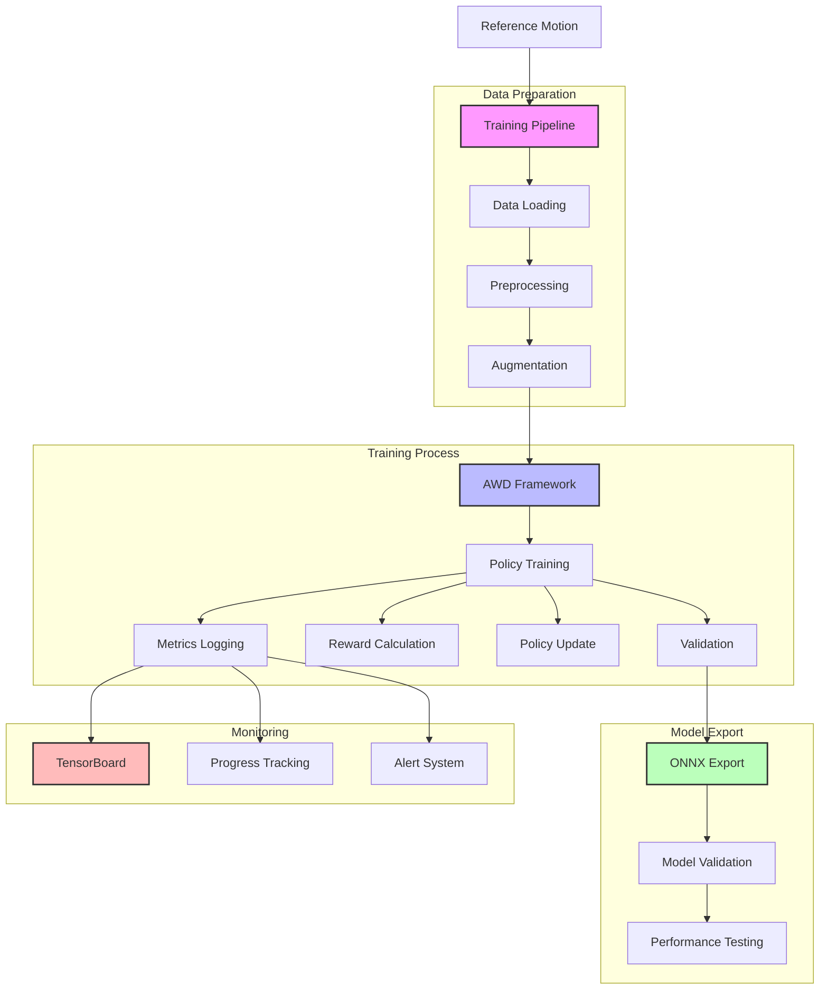

# Training Pipeline System

## System Flow


## Overview
This document details the implementation of the training pipeline system that converts reference motions into ONNX policies using the AWD (Automated Walking Development) framework.

## System Architecture
```
app/
├── services/
│   └── training/
│       ├── __init__.py
│       ├── trainer.py        # Training orchestration
│       ├── converter.py      # ONNX conversion
│       └── monitor.py        # Training progress monitoring
├── models/
│   └── training/
│       ├── __init__.py
│       ├── policy.py         # Policy model definition
│       └── session.py        # Training session tracking
└── templates/
    └── training/
        ├── configure.html    # Training configuration
        ├── monitor.html      # Training progress view
        └── results.html      # Results visualization
```

## Implementation Details

### 1. Training Service (`app/services/training/trainer.py`)
```python
import torch
import torch.nn as nn
from pathlib import Path
from app.config import Config
from app.utils.logging import get_logger
from app.models.training import TrainingSession

logger = get_logger(__name__)

class PolicyTrainer:
    def __init__(self):
        self.device = torch.device('cuda' if torch.cuda.is_available() else 'cpu')
        self.output_dir = Path(Config.MODEL_OUTPUT_DIR)
        self.output_dir.mkdir(exist_ok=True)
        
    def train_policy(self, reference_motion_path, params):
        """Train policy from reference motion.
        
        Args:
            reference_motion_path (str): Path to reference motion file
            params (dict): Training parameters including:
                - epochs (int): Number of training epochs
                - batch_size (int): Batch size
                - learning_rate (float): Learning rate
                - hidden_size (int): Size of hidden layers
        
        Returns:
            str: Path to trained ONNX model
        """
        try:
            # Load reference motion
            motion_data = np.load(reference_motion_path)
            
            # Initialize AWD training framework
            from awd import PolicyNetwork, Trainer
            
            # Create policy network
            policy = PolicyNetwork(
                input_size=motion_data.shape[1],
                hidden_size=params['hidden_size'],
                output_size=len(Config.JOINT_NAMES)
            ).to(self.device)
            
            # Initialize trainer
            trainer = Trainer(
                policy=policy,
                learning_rate=params['learning_rate'],
                device=self.device
            )
            
            # Create training session
            session = TrainingSession(
                reference_motion=reference_motion_path,
                parameters=params,
                status='running'
            )
            db.session.add(session)
            db.session.commit()
            
            # Training loop
            for epoch in range(params['epochs']):
                loss = trainer.train_epoch(
                    motion_data,
                    batch_size=params['batch_size']
                )
                
                # Update session progress
                session.current_epoch = epoch + 1
                session.current_loss = float(loss)
                db.session.commit()
                
                logger.info(f"Epoch {epoch+1}/{params['epochs']}, Loss: {loss:.4f}")
            
            # Export to ONNX
            output_path = self.output_dir / f"policy_{session.id}.onnx"
            self.export_to_onnx(policy, output_path)
            
            # Update session
            session.status = 'completed'
            session.model_path = str(output_path)
            db.session.commit()
            
            return str(output_path)
            
        except Exception as e:
            logger.error(f"Training failed: {str(e)}")
            if session:
                session.status = 'failed'
                session.error_message = str(e)
                db.session.commit()
            raise
            
    def export_to_onnx(self, policy, output_path):
        """Export PyTorch policy to ONNX format."""
        dummy_input = torch.randn(1, policy.input_size).to(self.device)
        torch.onnx.export(
            policy,
            dummy_input,
            output_path,
            input_names=['input'],
            output_names=['output'],
            dynamic_axes={
                'input': {0: 'batch_size'},
                'output': {0: 'batch_size'}
            }
        )
```

### 2. Training Monitor (`app/services/training/monitor.py`)
```python
from app.models.training import TrainingSession
from app.utils.logging import get_logger

logger = get_logger(__name__)

class TrainingMonitor:
    def get_session_status(self, session_id):
        """Get current status of training session.
        
        Args:
            session_id (int): Training session ID
            
        Returns:
            dict: Session status information
        """
        session = TrainingSession.query.get(session_id)
        if not session:
            return None
            
        return {
            'id': session.id,
            'status': session.status,
            'current_epoch': session.current_epoch,
            'total_epochs': session.parameters['epochs'],
            'current_loss': session.current_loss,
            'error_message': session.error_message
        }
        
    def get_training_metrics(self, session_id):
        """Get training metrics for visualization.
        
        Args:
            session_id (int): Training session ID
            
        Returns:
            dict: Training metrics
        """
        session = TrainingSession.query.get(session_id)
        if not session:
            return None
            
        return {
            'epochs': list(range(1, session.current_epoch + 1)),
            'losses': session.loss_history
        }
```

### 3. Training Models (`app/models/training/session.py`)
```python
from datetime import datetime
from app import db

class TrainingSession(db.Model):
    id = db.Column(db.Integer, primary_key=True)
    reference_motion = db.Column(db.String(256))
    parameters = db.Column(db.JSON)
    status = db.Column(db.String(32))  # running, completed, failed
    current_epoch = db.Column(db.Integer, default=0)
    current_loss = db.Column(db.Float)
    loss_history = db.Column(db.JSON, default=list)
    model_path = db.Column(db.String(256))
    error_message = db.Column(db.Text)
    created_at = db.Column(db.DateTime, default=datetime.utcnow)
    completed_at = db.Column(db.DateTime)
    
    def to_dict(self):
        return {
            'id': self.id,
            'reference_motion': self.reference_motion,
            'parameters': self.parameters,
            'status': self.status,
            'progress': {
                'current_epoch': self.current_epoch,
                'total_epochs': self.parameters.get('epochs'),
                'current_loss': self.current_loss
            },
            'model_path': self.model_path,
            'created_at': self.created_at.isoformat(),
            'completed_at': self.completed_at.isoformat() if self.completed_at else None
        }
```

### 4. Training Configuration Interface (`templates/training/configure.html`)
```html



<div class="training-config">
    <h2>Configure Training</h2>
    
    <form id="training-form" class="training-form">
        <div class="form-group">
            <label for="reference-motion">Reference Motion</label>
            <select id="reference-motion" name="reference_motion" required>
                
                <option value="{{ motion.file_path }}">{{ motion.name }}</option>
                
            </select>
        </div>
        
        <div class="form-group">
            <label for="epochs">Training Epochs</label>
            <input type="number" id="epochs" name="epochs"
                   min="1" max="1000" step="1" value="100">
        </div>
        
        <div class="form-group">
            <label for="batch-size">Batch Size</label>
            <input type="number" id="batch-size" name="batch_size"
                   min="1" max="512" step="1" value="32">
        </div>
        
        <div class="form-group">
            <label for="learning-rate">Learning Rate</label>
            <input type="number" id="learning-rate" name="learning_rate"
                   min="0.0001" max="0.1" step="0.0001" value="0.001">
        </div>
        
        <div class="form-group">
            <label for="hidden-size">Hidden Layer Size</label>
            <input type="number" id="hidden-size" name="hidden_size"
                   min="32" max="512" step="32" value="256">
        </div>
        
        <button type="submit" class="btn btn-primary">Start Training</button>
    </form>
</div>



<script src="{{ url_for('static', filename='js/training-config.js') }}"></script>

```

### 5. Training API Routes (`app/routes/training.py`)
```python
from flask import Blueprint, request, jsonify
from app.services.training import PolicyTrainer, TrainingMonitor
from app.models.training import TrainingSession
from app import db

bp = Blueprint('training', __name__, url_prefix='/training')

@bp.route('/start', methods=['POST'])
def start_training():
    try:
        params = request.get_json()
        
        # Initialize trainer
        trainer = PolicyTrainer()
        
        # Start training in background task
        from app.tasks import train_policy_task
        task = train_policy_task.delay(
            reference_motion_path=params['reference_motion'],
            training_params=params
        )
        
        return jsonify({
            'message': 'Training started',
            'task_id': task.id
        })
        
    except Exception as e:
        return jsonify({'error': str(e)}), 500

@bp.route('/status/<int:session_id>', methods=['GET'])
def get_status(session_id):
    try:
        monitor = TrainingMonitor()
        status = monitor.get_session_status(session_id)
        
        if not status:
            return jsonify({'error': 'Session not found'}), 404
            
        return jsonify(status)
        
    except Exception as e:
        return jsonify({'error': str(e)}), 500

@bp.route('/metrics/<int:session_id>', methods=['GET'])
def get_metrics(session_id):
    try:
        monitor = TrainingMonitor()
        metrics = monitor.get_training_metrics(session_id)
        
        if not metrics:
            return jsonify({'error': 'Session not found'}), 404
            
        return jsonify(metrics)
        
    except Exception as e:
        return jsonify({'error': str(e)}), 500
```

## Integration with AWD Framework

1. **Submodule Setup**
```bash
cd submodules
git submodule add https://github.com/rimim/AWD.git
```

2. **Python Path Configuration**
```python
import sys
from pathlib import Path

# Add submodule to Python path
awd_path = Path(__file__).parent.parent / 'submodules' / 'AWD'
sys.path.append(str(awd_path))
```

## Testing

Create test files in `tests/training/`:
```python
import pytest
import torch
from app.services.training import PolicyTrainer, TrainingMonitor

def test_policy_training():
    trainer = PolicyTrainer()
    params = {
        'epochs': 10,
        'batch_size': 32,
        'learning_rate': 0.001,
        'hidden_size': 256
    }
    
    # Create dummy reference motion
    motion_data = np.random.randn(1000, 10)  # 1000 timesteps, 10 joints
    motion_path = 'test_motion.npy'
    np.save(motion_path, motion_data)
    
    try:
        model_path = trainer.train_policy(motion_path, params)
        assert Path(model_path).exists()
        assert model_path.endswith('.onnx')
    finally:
        Path(motion_path).unlink()
        Path(model_path).unlink()
```

## Security Considerations

1. **Resource Management**
   - Implement training timeouts
   - Monitor GPU memory usage
   - Limit concurrent training sessions

2. **Model Security**
   - Validate model inputs/outputs
   - Implement model versioning
   - Secure model storage

3. **Access Control**
   - Implement user permissions
   - Track training session ownership
   - Limit resource usage per user

## Next Steps

1. Implement distributed training
2. Add model versioning
3. Create model registry
4. Add hyperparameter optimization 
