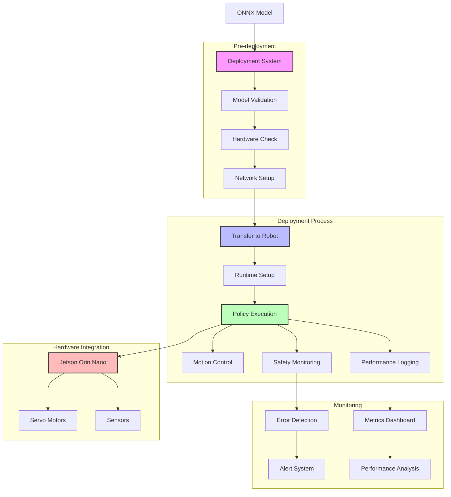

# Deployment System

## System Flow


## Overview
This document details the implementation of the deployment system that handles the transfer and execution of trained ONNX policies on Jetson Orin Nano boards for the Duck Droid.

## System Architecture
```
app/
├── services/
│   └── deployment/
│       ├── __init__.py
│       ├── deployer.py      # Deployment orchestration
│       ├── validator.py     # Model validation
│       └── monitor.py       # Deployment monitoring
├── models/
│   └── deployment/
│       ├── __init__.py
│       ├── device.py        # Device management
│       └── deployment.py    # Deployment tracking
└── templates/
    └── deployment/
        ├── devices.html     # Device management UI
        ├── deploy.html      # Deployment interface
        └── monitor.html     # Deployment monitoring
```

## Implementation Details

### 1. Deployment Service (`app/services/deployment/deployer.py`)
```python
import paramiko
import onnxruntime as ort
from pathlib import Path
from app.config import Config
from app.utils.logging import get_logger
from app.models.deployment import Device, Deployment

logger = get_logger(__name__)

class PolicyDeployer:
    def __init__(self):
        self.model_dir = Path(Config.MODEL_OUTPUT_DIR)
        
    def deploy_to_device(self, model_path, device_id, params):
        """Deploy ONNX policy to Jetson device.
        
        Args:
            model_path (str): Path to ONNX model file
            device_id (int): Target device ID
            params (dict): Deployment parameters
        
        Returns:
            bool: Deployment success status
        """
        try:
            # Get device information
            device = Device.query.get(device_id)
            if not device:
                raise ValueError(f"Device {device_id} not found")
                
            # Validate model
            self.validate_model(model_path)
            
            # Create deployment record
            deployment = Deployment(
                device_id=device_id,
                model_path=model_path,
                status='deploying',
                parameters=params
            )
            db.session.add(deployment)
            db.session.commit()
            
            # Connect to device
            ssh = paramiko.SSHClient()
            ssh.set_missing_host_key_policy(paramiko.AutoAddPolicy())
            ssh.connect(
                device.ip_address,
                username=device.username,
                password=device.password
            )
            
            try:
                # Create remote directories
                sftp = ssh.open_sftp()
                remote_dir = f"/home/{device.username}/models"
                sftp.mkdir(remote_dir, ignore_existing=True)
                
                # Upload model
                remote_path = f"{remote_dir}/{Path(model_path).name}"
                sftp.put(model_path, remote_path)
                
                # Update model symlink
                sftp.remove(f"{remote_dir}/current_model.onnx", ignore_missing=True)
                sftp.symlink(remote_path, f"{remote_dir}/current_model.onnx")
                
                # Update deployment status
                deployment.status = 'deployed'
                deployment.remote_path = remote_path
                db.session.commit()
                
                # Restart policy service
                self.restart_policy_service(ssh)
                
                return True
                
            finally:
                sftp.close()
                ssh.close()
                
        except Exception as e:
            logger.error(f"Deployment failed: {str(e)}")
            if deployment:
                deployment.status = 'failed'
                deployment.error_message = str(e)
                db.session.commit()
            raise
            
    def validate_model(self, model_path):
        """Validate ONNX model before deployment."""
        try:
            # Check file exists
            if not Path(model_path).exists():
                raise ValueError(f"Model file not found: {model_path}")
                
            # Validate ONNX format
            ort_session = ort.InferenceSession(model_path)
            
            # Check input/output shapes
            input_name = ort_session.get_inputs()[0].name
            output_name = ort_session.get_outputs()[0].name
            
            # Validate with dummy input
            import numpy as np
            dummy_input = np.random.randn(1, ort_session.get_inputs()[0].shape[1]).astype(np.float32)
            ort_session.run([output_name], {input_name: dummy_input})
            
        except Exception as e:
            raise ValueError(f"Model validation failed: {str(e)}")
            
    def restart_policy_service(self, ssh):
        """Restart policy service on remote device."""
        try:
            # Stop existing service
            ssh.exec_command('sudo systemctl stop duck_policy')
            
            # Start service
            stdin, stdout, stderr = ssh.exec_command('sudo systemctl start duck_policy')
            exit_status = stdout.channel.recv_exit_status()
            
            if exit_status != 0:
                raise RuntimeError(f"Failed to restart policy service: {stderr.read().decode()}")
                
        except Exception as e:
            raise RuntimeError(f"Service restart failed: {str(e)}")
```

### 2. Device Management (`app/models/deployment/device.py`)
```python
from datetime import datetime
from app import db

class Device(db.Model):
    id = db.Column(db.Integer, primary_key=True)
    name = db.Column(db.String(64), unique=True)
    ip_address = db.Column(db.String(15))
    username = db.Column(db.String(32))
    password = db.Column(db.String(256))  # Encrypted
    status = db.Column(db.String(32))     # online, offline, error
    last_seen = db.Column(db.DateTime)
    created_at = db.Column(db.DateTime, default=datetime.utcnow)
    
    def to_dict(self):
        return {
            'id': self.id,
            'name': self.name,
            'ip_address': self.ip_address,
            'status': self.status,
            'last_seen': self.last_seen.isoformat() if self.last_seen else None
        }
```

### 3. Deployment Tracking (`app/models/deployment/deployment.py`)
```python
from datetime import datetime
from app import db

class Deployment(db.Model):
    id = db.Column(db.Integer, primary_key=True)
    device_id = db.Column(db.Integer, db.ForeignKey('device.id'))
    model_path = db.Column(db.String(256))
    remote_path = db.Column(db.String(256))
    status = db.Column(db.String(32))  # deploying, deployed, failed
    parameters = db.Column(db.JSON)
    error_message = db.Column(db.Text)
    created_at = db.Column(db.DateTime, default=datetime.utcnow)
    completed_at = db.Column(db.DateTime)
    
    device = db.relationship('Device', backref='deployments')
    
    def to_dict(self):
        return {
            'id': self.id,
            'device': self.device.to_dict(),
            'model_path': self.model_path,
            'remote_path': self.remote_path,
            'status': self.status,
            'created_at': self.created_at.isoformat(),
            'completed_at': self.completed_at.isoformat() if self.completed_at else None
        }
```

### 4. Device Management Interface (`templates/deployment/devices.html`)
```html



<div class="device-management">
    <h2>Device Management</h2>
    
    <!-- Add Device Form -->
    <form id="device-form" class="device-form">
        <h3>Add New Device</h3>
        
        <div class="form-group">
            <label for="device-name">Device Name</label>
            <input type="text" id="device-name" name="name" required>
        </div>
        
        <div class="form-group">
            <label for="ip-address">IP Address</label>
            <input type="text" id="ip-address" name="ip_address" 
                   pattern="\d{1,3}\.\d{1,3}\.\d{1,3}\.\d{1,3}" required>
        </div>
        
        <div class="form-group">
            <label for="username">Username</label>
            <input type="text" id="username" name="username" required>
        </div>
        
        <div class="form-group">
            <label for="password">Password</label>
            <input type="password" id="password" name="password" required>
        </div>
        
        <button type="submit" class="btn btn-primary">Add Device</button>
    </form>
    
    <!-- Device List -->
    <div class="device-list">
        <h3>Registered Devices</h3>
        
        <table class="device-table">
            <thead>
                <tr>
                    <th>Name</th>
                    <th>IP Address</th>
                    <th>Status</th>
                    <th>Last Seen</th>
                    <th>Actions</th>
                </tr>
            </thead>
            <tbody>
                
                <tr>
                    <td>{{ device.name }}</td>
                    <td>{{ device.ip_address }}</td>
                    <td>{{ device.status }}</td>
                    <td>{{ device.last_seen }}</td>
                    <td>
                        <button class="btn btn-sm btn-info" 
                                onclick="testConnection({{ device.id }})">
                            Test Connection
                        </button>
                        <button class="btn btn-sm btn-danger"
                                onclick="deleteDevice({{ device.id }})">
                            Delete
                        </button>
                    </td>
                </tr>
                
            </tbody>
        </table>
    </div>
</div>



<script src="{{ url_for('static', filename='js/device-management.js') }}"></script>

```

### 5. Deployment API Routes (`app/routes/deployment.py`)
```python
from flask import Blueprint, request, jsonify
from app.services.deployment import PolicyDeployer
from app.models.deployment import Device, Deployment
from app import db

bp = Blueprint('deployment', __name__, url_prefix='/deployment')

@bp.route('/deploy', methods=['POST'])
def deploy_model():
    try:
        data = request.get_json()
        
        # Initialize deployer
        deployer = PolicyDeployer()
        
        # Start deployment in background task
        from app.tasks import deploy_model_task
        task = deploy_model_task.delay(
            model_path=data['model_path'],
            device_id=data['device_id'],
            params=data.get('parameters', {})
        )
        
        return jsonify({
            'message': 'Deployment started',
            'task_id': task.id
        })
        
    except Exception as e:
        return jsonify({'error': str(e)}), 500

@bp.route('/devices', methods=['GET'])
def list_devices():
    try:
        devices = Device.query.all()
        return jsonify([device.to_dict() for device in devices])
    except Exception as e:
        return jsonify({'error': str(e)}), 500

@bp.route('/devices', methods=['POST'])
def add_device():
    try:
        data = request.get_json()
        
        device = Device(
            name=data['name'],
            ip_address=data['ip_address'],
            username=data['username'],
            password=data['password'],  # Should be encrypted
            status='offline'
        )
        
        db.session.add(device)
        db.session.commit()
        
        return jsonify(device.to_dict())
        
    except Exception as e:
        return jsonify({'error': str(e)}), 500

@bp.route('/devices/<int:device_id>/test', methods=['POST'])
def test_device_connection(device_id):
    try:
        device = Device.query.get(device_id)
        if not device:
            return jsonify({'error': 'Device not found'}), 404
            
        deployer = PolicyDeployer()
        success = deployer.test_connection(device)
        
        return jsonify({'success': success})
        
    except Exception as e:
        return jsonify({'error': str(e)}), 500
```

## Security Considerations

1. **Device Authentication**
   - Encrypt stored credentials
   - Use SSH keys instead of passwords
   - Implement device verification

2. **Network Security**
   - Use secure protocols (SSH/SFTP)
   - Implement firewall rules
   - Monitor network activity

3. **Access Control**
   - Implement role-based access
   - Audit deployment actions
   - Secure device management

## Testing

Create test files in `tests/deployment/`:
```python
import pytest
from unittest.mock import Mock, patch
from app.services.deployment import PolicyDeployer
from app.models.deployment import Device, Deployment

@pytest.fixture
def mock_ssh():
    with patch('paramiko.SSHClient') as mock:
        yield mock

def test_model_deployment(mock_ssh):
    deployer = PolicyDeployer()
    device = Device(
        id=1,
        name='test_device',
        ip_address='192.168.1.10',
        username='test',
        password='password'
    )
    
    # Create test model
    import numpy as np
    dummy_model = np.random.randn(1000, 10)
    model_path = 'test_model.onnx'
    np.save(model_path, dummy_model)
    
    try:
        success = deployer.deploy_to_device(
            model_path=model_path,
            device_id=device.id,
            params={}
        )
        assert success
        
        # Verify SSH calls
        mock_ssh.return_value.connect.assert_called_once_with(
            device.ip_address,
            username=device.username,
            password=device.password
        )
        
    finally:
        Path(model_path).unlink()
```

## Next Steps

1. Implement device auto-discovery
2. Add deployment rollback
3. Create device groups
4. Add deployment scheduling 
