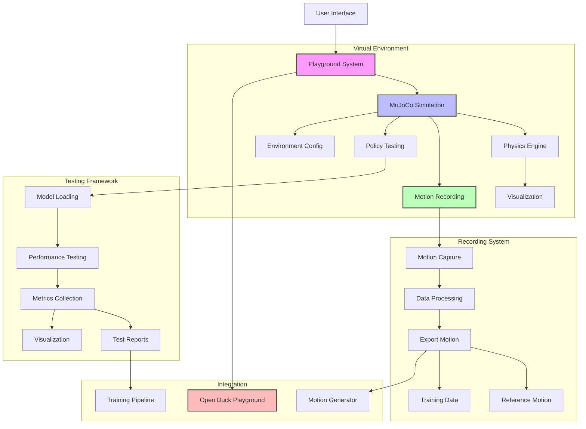

# Playground Integration System

## System Flow


## Overview
This document details the integration of the Open Duck Playground into the BUDC system, providing a virtual environment for testing and recording reference motions.

## System Architecture
```
app/
├── services/
│   └── playground/
│       ├── __init__.py
│       ├── manager.py       # Playground process management
│       ├── recorder.py      # Motion recording
│       └── simulator.py     # Physics simulation
├── models/
│   └── playground/
│       ├── __init__.py
│       ├── session.py       # Playground session tracking
│       └── recording.py     # Motion recording data
└── templates/
    └── playground/
        ├── viewer.html      # Playground interface
        ├── controls.html    # Control interface
        └── recordings.html  # Recording management
```

## Implementation Details

### 1. Playground Manager (`app/services/playground/manager.py`)
```python
import subprocess
import psutil
import websockets
import asyncio
from pathlib import Path
from app.config import Config
from app.utils.logging import get_logger
from app.models.playground import PlaygroundSession

logger = get_logger(__name__)

class PlaygroundManager:
    def __init__(self):
        self.playground_path = Path(Config.SUBMODULES_DIR) / 'Open_Duck_Playground'
        self.active_sessions = {}
        
    async def start_session(self, session_id):
        """Start a new playground session.
        
        Args:
            session_id (int): Session identifier
            
        Returns:
            dict: Session information including websocket URL
        """
        try:
            # Check if playground server is already running
            if session_id in self.active_sessions:
                return self.active_sessions[session_id]
                
            # Find available port
            port = self._find_available_port()
            
            # Start playground server
            process = subprocess.Popen([
                'python',
                str(self.playground_path / 'server.py'),
                '--port', str(port),
                '--session-id', str(session_id)
            ])
            
            # Wait for server to start
            await asyncio.sleep(2)
            
            # Create session record
            session = PlaygroundSession(
                id=session_id,
                port=port,
                pid=process.pid,
                status='running'
            )
            db.session.add(session)
            db.session.commit()
            
            # Store session info
            session_info = {
                'id': session_id,
                'port': port,
                'websocket_url': f"ws://localhost:{port}",
                'pid': process.pid
            }
            self.active_sessions[session_id] = session_info
            
            return session_info
            
        except Exception as e:
            logger.error(f"Failed to start playground session: {str(e)}")
            raise
            
    async def stop_session(self, session_id):
        """Stop a playground session.
        
        Args:
            session_id (int): Session identifier
        """
        try:
            if session_id not in self.active_sessions:
                return
                
            session_info = self.active_sessions[session_id]
            
            # Kill process
            process = psutil.Process(session_info['pid'])
            process.terminate()
            process.wait()
            
            # Update session record
            session = PlaygroundSession.query.get(session_id)
            if session:
                session.status = 'stopped'
                session.stopped_at = datetime.utcnow()
                db.session.commit()
                
            # Remove from active sessions
            del self.active_sessions[session_id]
            
        except Exception as e:
            logger.error(f"Failed to stop playground session: {str(e)}")
            raise
            
    def _find_available_port(self):
        """Find an available port for the playground server."""
        import socket
        with socket.socket(socket.AF_INET, socket.SOCK_STREAM) as s:
            s.bind(('', 0))
            s.listen(1)
            port = s.getsockname()[1]
        return port
```

### 2. Motion Recorder (`app/services/playground/recorder.py`)
```python
import numpy as np
from pathlib import Path
from app.config import Config
from app.utils.logging import get_logger
from app.models.playground import Recording

logger = get_logger(__name__)

class MotionRecorder:
    def __init__(self):
        self.output_dir = Path(Config.MOTION_OUTPUT_DIR)
        self.output_dir.mkdir(exist_ok=True)
        
    def start_recording(self, session_id):
        """Start recording motion data.
        
        Args:
            session_id (int): Playground session ID
            
        Returns:
            Recording: Created recording record
        """
        recording = Recording(
            session_id=session_id,
            status='recording',
            frames=[]
        )
        db.session.add(recording)
        db.session.commit()
        
        return recording
        
    def record_frame(self, recording_id, frame_data):
        """Record a single frame of motion data.
        
        Args:
            recording_id (int): Recording identifier
            frame_data (dict): Frame data including joint angles and timestamps
        """
        recording = Recording.query.get(recording_id)
        if not recording or recording.status != 'recording':
            raise ValueError(f"Invalid recording ID or status: {recording_id}")
            
        recording.frames.append(frame_data)
        db.session.commit()
        
    def stop_recording(self, recording_id):
        """Stop recording and save motion data.
        
        Args:
            recording_id (int): Recording identifier
            
        Returns:
            str: Path to saved motion file
        """
        recording = Recording.query.get(recording_id)
        if not recording:
            raise ValueError(f"Recording not found: {recording_id}")
            
        try:
            # Convert frames to numpy array
            frames = np.array(recording.frames)
            
            # Save to file
            output_path = self.output_dir / f"recording_{recording_id}.motion"
            np.save(output_path, {
                'joint_angles': frames['joint_angles'],
                'timestamps': frames['timestamps'],
                'metadata': {
                    'session_id': recording.session_id,
                    'created_at': recording.created_at.isoformat()
                }
            })
            
            # Update recording status
            recording.status = 'completed'
            recording.file_path = str(output_path)
            db.session.commit()
            
            return str(output_path)
            
        except Exception as e:
            recording.status = 'failed'
            recording.error_message = str(e)
            db.session.commit()
            raise
```

### 3. Session Models (`app/models/playground/session.py`)
```python
from datetime import datetime
from app import db

class PlaygroundSession(db.Model):
    id = db.Column(db.Integer, primary_key=True)
    port = db.Column(db.Integer)
    pid = db.Column(db.Integer)
    status = db.Column(db.String(32))  # running, stopped, error
    created_at = db.Column(db.DateTime, default=datetime.utcnow)
    stopped_at = db.Column(db.DateTime)
    
    recordings = db.relationship('Recording', backref='session')
    
    def to_dict(self):
        return {
            'id': self.id,
            'port': self.port,
            'status': self.status,
            'created_at': self.created_at.isoformat(),
            'stopped_at': self.stopped_at.isoformat() if self.stopped_at else None
        }

class Recording(db.Model):
    id = db.Column(db.Integer, primary_key=True)
    session_id = db.Column(db.Integer, db.ForeignKey('playground_session.id'))
    status = db.Column(db.String(32))  # recording, completed, failed
    frames = db.Column(db.JSON, default=list)
    file_path = db.Column(db.String(256))
    error_message = db.Column(db.Text)
    created_at = db.Column(db.DateTime, default=datetime.utcnow)
    completed_at = db.Column(db.DateTime)
    
    def to_dict(self):
        return {
            'id': self.id,
            'session_id': self.session_id,
            'status': self.status,
            'file_path': self.file_path,
            'created_at': self.created_at.isoformat(),
            'completed_at': self.completed_at.isoformat() if self.completed_at else None
        }
```

### 4. Playground Interface (`templates/playground/viewer.html`)
```html



<div class="playground-viewer">
    <div class="playground-container">
        <!-- Playground canvas will be rendered here -->
        <canvas id="playground-canvas"></canvas>
        
        <!-- Control panel -->
        <div class="control-panel">
            <div class="recording-controls">
                <button id="start-recording" class="btn btn-danger">
                    Start Recording
                </button>
                <button id="stop-recording" class="btn btn-secondary" disabled>
                    Stop Recording
                </button>
            </div>
            
            <div class="playback-controls">
                <button id="play-pause" class="btn btn-primary">
                    Play
                </button>
                <input type="range" id="timeline" min="0" max="100" value="0">
                <span id="timestamp">00:00</span>
            </div>
        </div>
    </div>
    
    <!-- Recording list -->
    <div class="recordings-list">
        <h3>Recorded Motions</h3>
        <table class="table">
            <thead>
                <tr>
                    <th>ID</th>
                    <th>Created</th>
                    <th>Duration</th>
                    <th>Actions</th>
                </tr>
            </thead>
            <tbody id="recordings-tbody">
                <!-- Recordings will be listed here -->
            </tbody>
        </table>
    </div>
</div>



<script src="{{ url_for('static', filename='js/playground-viewer.js') }}"></script>
<script>
    // Initialize playground viewer
    document.addEventListener('DOMContentLoaded', function() {
        const viewer = new PlaygroundViewer({
            canvasId: 'playground-canvas',
            websocketUrl: '{{ session.websocket_url }}'
        });
        
        // Initialize recording controls
        const recordingControls = new RecordingControls({
            startButton: document.getElementById('start-recording'),
            stopButton: document.getElementById('stop-recording'),
            onStart: () => viewer.startRecording(),
            onStop: () => viewer.stopRecording()
        });
        
        // Initialize playback controls
        const playbackControls = new PlaybackControls({
            playButton: document.getElementById('play-pause'),
            timeline: document.getElementById('timeline'),
            timestamp: document.getElementById('timestamp'),
            onPlay: () => viewer.play(),
            onPause: () => viewer.pause(),
            onSeek: (time) => viewer.seek(time)
        });
    });
</script>

```

### 5. Playground API Routes (`app/routes/playground.py`)
```python
from flask import Blueprint, request, jsonify
from app.services.playground import PlaygroundManager, MotionRecorder
from app.models.playground import PlaygroundSession, Recording
from app import db

bp = Blueprint('playground', __name__, url_prefix='/playground')

@bp.route('/sessions', methods=['POST'])
async def create_session():
    try:
        manager = PlaygroundManager()
        session_id = request.json.get('session_id')
        
        session_info = await manager.start_session(session_id)
        return jsonify(session_info)
        
    except Exception as e:
        return jsonify({'error': str(e)}), 500

@bp.route('/sessions/<int:session_id>', methods=['DELETE'])
async def stop_session(session_id):
    try:
        manager = PlaygroundManager()
        await manager.stop_session(session_id)
        return jsonify({'message': 'Session stopped'})
        
    except Exception as e:
        return jsonify({'error': str(e)}), 500

@bp.route('/recordings', methods=['POST'])
def start_recording():
    try:
        session_id = request.json.get('session_id')
        
        recorder = MotionRecorder()
        recording = recorder.start_recording(session_id)
        
        return jsonify(recording.to_dict())
        
    except Exception as e:
        return jsonify({'error': str(e)}), 500

@bp.route('/recordings/<int:recording_id>/frames', methods=['POST'])
def record_frame(recording_id):
    try:
        frame_data = request.get_json()
        
        recorder = MotionRecorder()
        recorder.record_frame(recording_id, frame_data)
        
        return jsonify({'message': 'Frame recorded'})
        
    except Exception as e:
        return jsonify({'error': str(e)}), 500

@bp.route('/recordings/<int:recording_id>', methods=['DELETE'])
def stop_recording(recording_id):
    try:
        recorder = MotionRecorder()
        file_path = recorder.stop_recording(recording_id)
        
        return jsonify({
            'message': 'Recording stopped',
            'file_path': file_path
        })
        
    except Exception as e:
        return jsonify({'error': str(e)}), 500
```

## Integration with Open Duck Playground

1. **Submodule Setup**
```bash
cd submodules
git submodule add https://github.com/apirrone/Open_Duck_Playground.git
```

2. **Python Path Configuration**
```python
import sys
from pathlib import Path

# Add submodule to Python path
playground_path = Path(__file__).parent.parent / 'submodules' / 'Open_Duck_Playground'
sys.path.append(str(playground_path))
```

## Testing

Create test files in `tests/playground/`:
```python
import pytest
import asyncio
from app.services.playground import PlaygroundManager, MotionRecorder

@pytest.mark.asyncio
async def test_playground_session():
    manager = PlaygroundManager()
    
    # Start session
    session_info = await manager.start_session(1)
    assert session_info['port'] > 0
    assert session_info['pid'] > 0
    
    try:
        # Test WebSocket connection
        uri = f"ws://localhost:{session_info['port']}"
        async with websockets.connect(uri) as websocket:
            # Send test message
            await websocket.send('{"type": "ping"}')
            response = await websocket.recv()
            assert response == '{"type": "pong"}'
            
    finally:
        # Stop session
        await manager.stop_session(1)
        
def test_motion_recording():
    recorder = MotionRecorder()
    
    # Start recording
    recording = recorder.start_recording(1)
    assert recording.status == 'recording'
    
    # Record frames
    for i in range(10):
        frame_data = {
            'joint_angles': [0.0] * 10,
            'timestamps': i * 0.1
        }
        recorder.record_frame(recording.id, frame_data)
        
    # Stop recording
    file_path = recorder.stop_recording(recording.id)
    assert Path(file_path).exists()
    
    # Verify recorded data
    data = np.load(file_path)
    assert len(data['joint_angles']) == 10
    assert len(data['timestamps']) == 10
```

## Security Considerations

1. **Process Management**
   - Implement process isolation
   - Monitor resource usage
   - Clean up orphaned processes

2. **WebSocket Security**
   - Implement authentication
   - Validate messages
   - Rate limit connections

3. **File Security**
   - Validate recorded data
   - Implement size limits
   - Secure file storage

## Next Steps

1. Add real-time visualization
2. Implement motion editing
3. Add physics simulation
4. Create motion templates 
