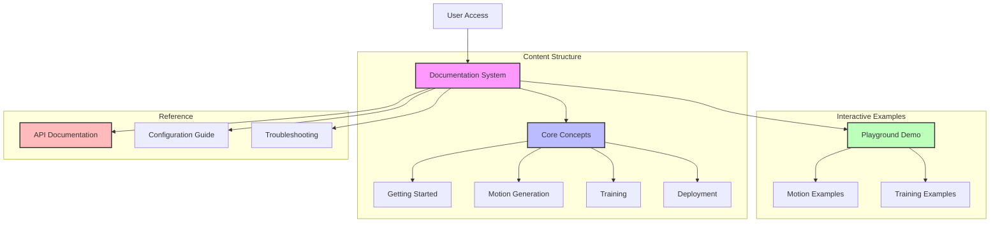

# System Documentation

## System Flow


## Overview
This document outlines the basic documentation structure that helps users understand the Duck Droid ecosystem, including motion generation, training, and deployment concepts.

## Documentation Structure
```
docs/
├── getting_started/
│   ├── introduction.md
│   ├── setup.md
│   └── quickstart.md
├── motion_generation/
│   ├── basics.md
│   ├── parameters.md
│   └── examples.md
├── training/
│   ├── concepts.md
│   ├── configuration.md
│   └── examples.md
└── deployment/
    ├── setup.md
    ├── monitoring.md
    └── troubleshooting.md
```

## Implementation Details

### 1. Documentation System (`app/services/docs/content.py`)
```python
from pathlib import Path
import markdown
import yaml
from app.config import Config
from app.utils.logging import get_logger

logger = get_logger(__name__)

class DocumentationManager:
    def __init__(self):
        self.docs_dir = Path(Config.DOCS_DIR)
        self.md = markdown.Markdown(extensions=['meta', 'fenced_code', 'toc'])
        
    def get_document(self, doc_path):
        """Load and parse a documentation file.
        
        Args:
            doc_path (str): Path to documentation file
            
        Returns:
            dict: Parsed documentation content
        """
        try:
            file_path = self.docs_dir / doc_path
            if not file_path.exists():
                raise ValueError(f"Document not found: {doc_path}")
                
            # Read and parse markdown
            content = file_path.read_text()
            html_content = self.md.convert(content)
            
            # Extract metadata
            metadata = self.md.Meta
            
            return {
                'path': doc_path,
                'title': metadata.get('title', [''])[0],
                'content': html_content
            }
            
        except Exception as e:
            logger.error(f"Failed to load document: {str(e)}")
            raise
            
    def get_section_structure(self):
        """Get the documentation section structure.
        
        Returns:
            dict: Section structure with metadata
        """
        try:
            structure = {}
            
            for section_dir in self.docs_dir.iterdir():
                if section_dir.is_dir():
                    # Load section metadata
                    meta_path = section_dir / 'metadata.yaml'
                    if meta_path.exists():
                        metadata = yaml.safe_load(meta_path.read_text())
                    else:
                        metadata = {
                            'title': section_dir.name,
                            'description': ''
                        }
                        
                    # Get documents
                    documents = []
                    for doc_file in section_dir.glob('*.md'):
                        if doc_file.name != 'metadata.yaml':
                            doc = self.get_document(
                                str(doc_file.relative_to(self.docs_dir))
                            )
                            documents.append(doc)
                            
                    structure[section_dir.name] = {
                        'metadata': metadata,
                        'documents': documents
                    }
                    
            return structure
            
        except Exception as e:
            logger.error(f"Failed to get section structure: {str(e)}")
            raise
```

### 2. Documentation Interface (`templates/docs/viewer.html`)
```html



<div class="documentation">
    <div class="sidebar">
        <nav class="doc-nav">
            
            <div class="section">
                <h3>{{ section.metadata.title }}</h3>
                <ul>
                    
                    <li>
                        <a href="{{ url_for('docs.view', path=doc.path) }}">
                            {{ doc.title }}
                        </a>
                    </li>
                    
                </ul>
            </div>
            
        </nav>
    </div>
    
    <div class="content">
        <article class="document">
            {{ document.content | safe }}
        </article>
        
        
        <div class="examples">
            <h3>Examples</h3>
            
            <div class="example">
                <h4>{{ example.title }}</h4>
                <pre><code>{{ example.code }}</code></pre>
            </div>
            
        </div>
        
    </div>
</div>

```

## Documentation Guidelines

1. **Document Structure**
```markdown
---
title: Introduction to Motion Generation
description: Learn the basics of generating reference motions
---

# Introduction to Motion Generation

## Overview
[Brief introduction to the topic]

## Key Concepts
1. [First concept]
2. [Second concept]
3. [Third concept]

## Example
[Code example or demonstration]
```

2. **Section Organization**
- Group related documents by topic
- Keep explanations clear and concise
- Include practical examples
- Provide troubleshooting tips

## Next Steps

1. Add more code examples
2. Create API documentation
3. Improve navigation
4. Add search functionality 
