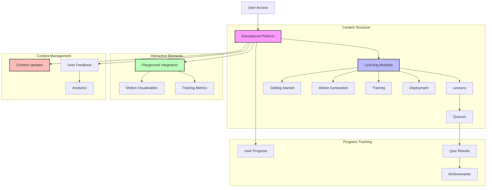

# Educational Content System

## System Flow


## Overview
This document details the implementation of the educational content system that helps users understand the Duck Droid ecosystem, including motion generation, training, and deployment concepts.

## System Architecture
```
app/
├── services/
│   └── education/
│       ├── __init__.py
│       ├── content.py       # Content management
│       ├── progress.py      # Progress tracking
│       └── quiz.py         # Quiz system
├── models/
│   └── education/
│       ├── __init__.py
│       ├── lesson.py       # Lesson content model
│       ├── progress.py     # User progress model
│       └── quiz.py        # Quiz model
└── templates/
    └── education/
        ├── lessons/        # Lesson templates
        ├── quizzes/        # Quiz templates
        └── dashboard.html  # Learning dashboard
```

## Content Structure

### 1. Module Organization
```
content/
├── getting_started/
│   ├── introduction.md
│   ├── setup.md
│   └── first_steps.md
├── motion_generation/
│   ├── basics.md
│   ├── parameters.md
│   └── advanced.md
├── training/
│   ├── concepts.md
│   ├── hyperparameters.md
│   └── optimization.md
└── deployment/
    ├── device_setup.md
    ├── monitoring.md
    └── troubleshooting.md
```

### 2. Content Management (`app/services/education/content.py`)
```python
from pathlib import Path
import markdown
import yaml
from app.config import Config
from app.utils.logging import get_logger
from app.models.education import Lesson

logger = get_logger(__name__)

class ContentManager:
    def __init__(self):
        self.content_dir = Path(Config.CONTENT_DIR)
        self.md = markdown.Markdown(extensions=['meta', 'fenced_code', 'toc'])
        
    def load_lesson(self, lesson_path):
        """Load and parse a lesson from markdown file.
        
        Args:
            lesson_path (str): Path to lesson file
            
        Returns:
            Lesson: Parsed lesson object
        """
        try:
            file_path = self.content_dir / lesson_path
            if not file_path.exists():
                raise ValueError(f"Lesson not found: {lesson_path}")
                
            # Read and parse markdown
            content = file_path.read_text()
            html_content = self.md.convert(content)
            
            # Extract metadata
            metadata = self.md.Meta
            
            # Create lesson object
            lesson = Lesson(
                path=lesson_path,
                title=metadata.get('title', [''])[0],
                description=metadata.get('description', [''])[0],
                content=html_content,
                prerequisites=metadata.get('prerequisites', []),
                difficulty=metadata.get('difficulty', ['beginner'])[0]
            )
            
            return lesson
            
        except Exception as e:
            logger.error(f"Failed to load lesson: {str(e)}")
            raise
            
    def get_module_structure(self):
        """Get the content module structure.
        
        Returns:
            dict: Module structure with metadata
        """
        try:
            structure = {}
            
            for module_dir in self.content_dir.iterdir():
                if module_dir.is_dir():
                    # Load module metadata
                    meta_path = module_dir / 'metadata.yaml'
                    if meta_path.exists():
                        metadata = yaml.safe_load(meta_path.read_text())
                    else:
                        metadata = {
                            'title': module_dir.name,
                            'description': ''
                        }
                        
                    # Get lessons
                    lessons = []
                    for lesson_file in module_dir.glob('*.md'):
                        if lesson_file.name != 'metadata.yaml':
                            lesson = self.load_lesson(
                                str(lesson_file.relative_to(self.content_dir))
                            )
                            lessons.append(lesson.to_dict())
                            
                    structure[module_dir.name] = {
                        'metadata': metadata,
                        'lessons': lessons
                    }
                    
            return structure
            
        except Exception as e:
            logger.error(f"Failed to get module structure: {str(e)}")
            raise
```

### 3. Progress Tracking (`app/services/education/progress.py`)
```python
from datetime import datetime
from app.models.education import UserProgress, LessonProgress
from app import db

class ProgressTracker:
    def get_user_progress(self, user_id):
        """Get user's learning progress.
        
        Args:
            user_id (int): User identifier
            
        Returns:
            dict: Progress information
        """
        progress = UserProgress.query.filter_by(user_id=user_id).first()
        if not progress:
            progress = UserProgress(user_id=user_id)
            db.session.add(progress)
            db.session.commit()
            
        return progress.to_dict()
        
    def mark_lesson_complete(self, user_id, lesson_path):
        """Mark a lesson as completed.
        
        Args:
            user_id (int): User identifier
            lesson_path (str): Path to completed lesson
        """
        progress = LessonProgress(
            user_id=user_id,
            lesson_path=lesson_path,
            completed_at=datetime.utcnow()
        )
        db.session.add(progress)
        db.session.commit()
        
    def get_next_lesson(self, user_id):
        """Get the next recommended lesson.
        
        Args:
            user_id (int): User identifier
            
        Returns:
            str: Path to next lesson
        """
        # Get completed lessons
        completed = LessonProgress.query.filter_by(user_id=user_id).all()
        completed_paths = {p.lesson_path for p in completed}
        
        # Get all lessons
        content_manager = ContentManager()
        structure = content_manager.get_module_structure()
        
        # Find first incomplete lesson
        for module in structure.values():
            for lesson in module['lessons']:
                if lesson['path'] not in completed_paths:
                    # Check prerequisites
                    prerequisites_met = all(
                        prereq in completed_paths
                        for prereq in lesson['prerequisites']
                    )
                    if prerequisites_met:
                        return lesson['path']
                        
        return None
```

### 4. Quiz System (`app/services/education/quiz.py`)
```python
from app.models.education import Quiz, QuizAttempt
from app import db

class QuizManager:
    def get_lesson_quiz(self, lesson_path):
        """Get quiz for a lesson.
        
        Args:
            lesson_path (str): Lesson path
            
        Returns:
            Quiz: Quiz object
        """
        return Quiz.query.filter_by(lesson_path=lesson_path).first()
        
    def submit_attempt(self, user_id, quiz_id, answers):
        """Submit a quiz attempt.
        
        Args:
            user_id (int): User identifier
            quiz_id (int): Quiz identifier
            answers (dict): User's answers
            
        Returns:
            dict: Attempt results
        """
        quiz = Quiz.query.get(quiz_id)
        if not quiz:
            raise ValueError(f"Quiz not found: {quiz_id}")
            
        # Grade answers
        correct_count = 0
        feedback = {}
        
        for question_id, answer in answers.items():
            question = quiz.questions[question_id]
            is_correct = answer == question['correct_answer']
            correct_count += is_correct
            
            feedback[question_id] = {
                'correct': is_correct,
                'explanation': question['explanation']
            }
            
        # Calculate score
        score = (correct_count / len(quiz.questions)) * 100
        
        # Save attempt
        attempt = QuizAttempt(
            user_id=user_id,
            quiz_id=quiz_id,
            score=score,
            answers=answers,
            feedback=feedback
        )
        db.session.add(attempt)
        db.session.commit()
        
        return attempt.to_dict()
```

### 5. Educational Models (`app/models/education/`)

#### Lesson Model (`lesson.py`)
```python
from app import db

class Lesson(db.Model):
    id = db.Column(db.Integer, primary_key=True)
    path = db.Column(db.String(256), unique=True)
    title = db.Column(db.String(128))
    description = db.Column(db.Text)
    content = db.Column(db.Text)
    prerequisites = db.Column(db.JSON, default=list)
    difficulty = db.Column(db.String(32))
    
    def to_dict(self):
        return {
            'id': self.id,
            'path': self.path,
            'title': self.title,
            'description': self.description,
            'prerequisites': self.prerequisites,
            'difficulty': self.difficulty
        }

class LessonProgress(db.Model):
    id = db.Column(db.Integer, primary_key=True)
    user_id = db.Column(db.Integer, db.ForeignKey('user.id'))
    lesson_path = db.Column(db.String(256))
    completed_at = db.Column(db.DateTime)
    
    def to_dict(self):
        return {
            'lesson_path': self.lesson_path,
            'completed_at': self.completed_at.isoformat()
        }
```

#### Quiz Model (`quiz.py`)
```python
from app import db

class Quiz(db.Model):
    id = db.Column(db.Integer, primary_key=True)
    lesson_path = db.Column(db.String(256))
    questions = db.Column(db.JSON)
    
    def to_dict(self):
        return {
            'id': self.id,
            'lesson_path': self.lesson_path,
            'question_count': len(self.questions)
        }

class QuizAttempt(db.Model):
    id = db.Column(db.Integer, primary_key=True)
    user_id = db.Column(db.Integer, db.ForeignKey('user.id'))
    quiz_id = db.Column(db.Integer, db.ForeignKey('quiz.id'))
    score = db.Column(db.Float)
    answers = db.Column(db.JSON)
    feedback = db.Column(db.JSON)
    created_at = db.Column(db.DateTime, default=datetime.utcnow)
    
    def to_dict(self):
        return {
            'id': self.id,
            'quiz_id': self.quiz_id,
            'score': self.score,
            'feedback': self.feedback,
            'created_at': self.created_at.isoformat()
        }
```

### 6. Learning Dashboard (`templates/education/dashboard.html`)
```html



<div class="learning-dashboard">
    <div class="progress-overview">
        <h2>Your Learning Progress</h2>
        
        <!-- Progress summary -->
        <div class="progress-summary">
            <div class="progress-stat">
                <span class="stat-label">Completed Lessons</span>
                <span class="stat-value">{{ progress.completed_lessons }}</span>
            </div>
            
            <div class="progress-stat">
                <span class="stat-label">Average Quiz Score</span>
                <span class="stat-value">{{ progress.average_score }}%</span>
            </div>
            
            <div class="progress-stat">
                <span class="stat-label">Time Spent</span>
                <span class="stat-value">{{ progress.time_spent }}</span>
            </div>
        </div>
        
        <!-- Module progress -->
        <div class="module-progress">
            
            <div class="module-card">
                <h3>{{ module.title }}</h3>
                <p>{{ module.description }}</p>
                
                <div class="progress-bar">
                    <div class="progress" style="width: {{ module.progress }}%"></div>
                </div>
                
                <div class="lesson-list">
                    
                    <div class="lesson-item {{ lesson.status }}">
                        <span class="lesson-title">{{ lesson.title }}</span>
                        
                        <span class="completion-date">{{ lesson.completed_at }}</span>
                        
                    </div>
                    
                </div>
            </div>
            
        </div>
    </div>
    
    <!-- Next steps -->
    <div class="next-steps">
        <h3>Recommended Next Steps</h3>
        
        
        <div class="next-lesson">
            <h4>{{ next_lesson.title }}</h4>
            <p>{{ next_lesson.description }}</p>
            <a href="{{ url_for('education.view_lesson', path=next_lesson.path) }}"
               class="btn btn-primary">
                Start Lesson
            </a>
        </div>
        
    </div>
</div>

```

## Content Creation Guidelines

1. **Lesson Structure**
```markdown
---
title: Introduction to Motion Generation
description: Learn the basics of generating reference motions for Duck Droid
prerequisites: []
difficulty: beginner
---

# Introduction to Motion Generation

## Overview
[Brief introduction to the topic]

## Key Concepts
1. [First concept]
2. [Second concept]
3. [Third concept]

## Practical Example
[Code example or demonstration]

## Quiz
[Quiz questions to test understanding]
```

2. **Module Organization**
- Group related lessons into modules
- Order lessons by complexity
- Include practical examples
- Add quizzes for validation

3. **Content Types**
- Text explanations
- Code examples
- Diagrams/illustrations
- Interactive demos
- Video tutorials

## Testing

Create test files in `tests/education/`:
```python
import pytest
from app.services.education import ContentManager, ProgressTracker, QuizManager

def test_content_loading():
    manager = ContentManager()
    
    # Test module structure
    structure = manager.get_module_structure()
    assert 'getting_started' in structure
    assert 'motion_generation' in structure
    
    # Test lesson loading
    lesson = manager.load_lesson('getting_started/introduction.md')
    assert lesson.title == 'Introduction to Motion Generation'
    assert lesson.difficulty == 'beginner'
    
def test_progress_tracking():
    tracker = ProgressTracker()
    
    # Test progress creation
    progress = tracker.get_user_progress(1)
    assert progress['completed_lessons'] == 0
    
    # Test lesson completion
    tracker.mark_lesson_complete(1, 'getting_started/introduction.md')
    progress = tracker.get_user_progress(1)
    assert progress['completed_lessons'] == 1
    
def test_quiz_system():
    quiz_manager = QuizManager()
    
    # Test quiz submission
    result = quiz_manager.submit_attempt(1, 1, {
        'q1': 'answer1',
        'q2': 'answer2'
    })
    assert 'score' in result
    assert 'feedback' in result
```

## Security Considerations

1. **Content Security**
   - Validate markdown content
   - Sanitize HTML output
   - Protect against XSS

2. **Progress Protection**
   - Verify user permissions
   - Prevent progress manipulation
   - Secure quiz answers

3. **Access Control**
   - Implement content restrictions
   - Track user activity
   - Rate limit requests

## Next Steps

1. Add interactive exercises
2. Implement video tutorials
3. Create content editor
4. Add social features 
