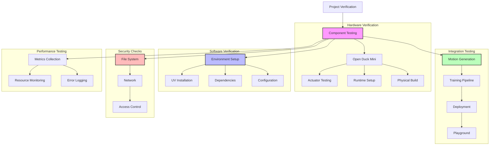

# Project-Specific Verifications

## System Flow


## Overview
This document details the specific verification steps required for each integrated submodule in the BUDC system.

## Open Duck Mini Verifications

### Hardware Compatibility
1. **Actuator Verification**
   - Verify actuator identification using Rhoban's BAM
   - Confirm servo motor compatibility
   - Test joint limits and ranges

2. **Runtime Environment**
   - Verify Raspberry Pi Zero 2W setup
   - Test policy execution on embedded system
   - Validate GPIO connections

3. **Physical Build**
   - Verify all 3D printed parts against print guide
   - Confirm assembly according to guide
   - Test mechanical movement ranges

## Open Duck Playground Verifications

### Training Environment
1. **UV Installation**
```bash
# Verify UV installation
curl -LsSf https://astral.sh/uv/install.sh | sh
uv --version
```

2. **Training Setup**
   - Verify imitation reward configuration
   - Check polynomial coefficients placement
   - Confirm tensor logging directory setup

3. **Project Structure**
   - Validate XML asset placement
   - Check sensor and geom naming conventions
   - Verify MJCF file structure

### Inference Verification
1. **ONNX Model Testing**
```bash
# Test ONNX inference
uv run playground/open_duck_mini_v2/mujoco_infer.py -o <path_to_model.onnx>
```

2. **Performance Metrics**
   - Verify model execution time
   - Check memory usage
   - Monitor GPU utilization

## Reference Motion Generator Verifications

### Motion Generation
1. **Installation Check**
```bash
# Verify UV installation and motion generation
uv run scripts/auto_waddle.py --duck open_duck_mini_v2 --num 1 --output_dir test_output
```

2. **Polynomial Fitting**
```bash
# Test polynomial fitting
uv run scripts/fit_poly.py --ref_motion <motion_file>
uv run scripts/plot_poly_fit.py --coefficients polynomial_coefficients.pkl
```

3. **Motion Validation**
   - Check motion file format
   - Verify joint angle ranges
   - Test motion replay functionality

## AWD Framework Verifications

### Environment Setup
1. **Isaac Gym Integration**
   - Verify Isaac Gym installation
   - Test CUDA compatibility
   - Check GPU requirements

2. **Dependencies**
```bash
# Verify Python dependencies
pip install -r requirements.txt
pip list | grep torch  # Check PyTorch version
```

### Training Verification
1. **Asset Configuration**
   - Verify URDF file placement
   - Check actuator properties in YAML
   - Validate mesh file paths

2. **Training Parameters**
   - Verify hyperparameters in YAML configs
   - Check environment settings
   - Test motion file compatibility

3. **Command Task Testing**
```bash
# Test training setup
python awd/run.py --task DucklingCommand --num_envs 1 \
    --cfg_env awd/data/cfg/open_duck_mini_v2/duckling_command.yaml \
    --cfg_train awd/data/cfg/open_duck_mini_v2/train/amp_duckling_task.yaml \
    --motion_file awd/data/motions/test_motion.json
```

## Integration Testing

### Cross-Module Verification
1. **Motion Pipeline**
   - Generate reference motion
   - Train policy using motion
   - Export to ONNX
   - Test on physical robot

2. **Data Flow**
   - Verify motion file compatibility
   - Check ONNX model format
   - Test deployment process

3. **Performance Metrics**
   - Measure end-to-end training time
   - Monitor resource usage
   - Track success rates

## Security Verifications

1. **File System Security**
   - Verify file permissions
   - Check secure storage of configurations
   - Monitor log file access

2. **Network Security**
   - Validate websocket connections
   - Test API endpoint security
   - Verify deployment channels

3. **Access Control**
   - Test user permissions
   - Verify role-based access
   - Monitor authentication logs

## Troubleshooting Guide

1. **Common Issues**
   - UV installation problems
   - CUDA compatibility issues
   - Motion generation failures
   - Training interruptions

2. **Resolution Steps**
   - Environment validation
   - Dependency checks
   - Log analysis procedures
   - Recovery protocols

## Next Steps

1. Implement automated testing
2. Create verification scripts
3. Develop monitoring dashboard
4. Establish CI/CD pipeline 
