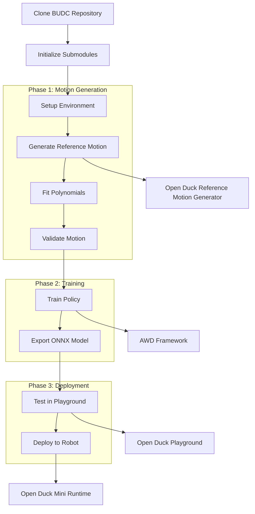
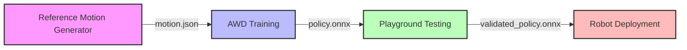

# Simplified Project Overview

## End-to-End Process Chart



## Quick Start Guide

1. **Clone and Setup**
```bash
# Clone main repository
git clone https://github.com/your-org/BUDC.git
cd BUDC

# Initialize submodules
git submodule update --init --recursive

# Install dependencies
pip install -r requirements.txt
```

2. **Generate Reference Motion**
```bash
# Generate motion
cd submodules/open_duck_reference_motion_generator
uv run scripts/auto_waddle.py --duck open_duck_mini_v2 --num 1 --output_dir ../motion_data

# Fit polynomials
uv run scripts/fit_poly.py --ref_motion ../motion_data/motion_0.json
```

3. **Train Policy**
```bash
cd ../awd
python awd/run.py --task DucklingCommand --num_envs 8 \
    --cfg_env awd/data/cfg/open_duck_mini_v2/duckling_command.yaml \
    --cfg_train awd/data/cfg/open_duck_mini_v2/train/amp_duckling_task.yaml \
    --motion_file ../motion_data/motion_0.json
```

4. **Test and Deploy**
```bash
# Test in playground
cd ../open_duck_playground
uv run playground/open_duck_mini_v2/mujoco_infer.py -o ../../trained_models/policy.onnx

# Deploy to robot
cd ../open_duck_mini
python deploy.py --model ../../trained_models/policy.onnx --target raspberrypi.local
```

## Submodule Overview

### 1. Open Duck Reference Motion Generator
**Purpose**: Creates reference motions for training
- Input: Motion parameters (speed, direction, etc.)
- Output: JSON files containing reference motions
- Key Feature: Generates parametric gaits using Placo

### 2. AWD (Adversarial Waddle Dynamics)
**Purpose**: Trains policies using reference motions
- Input: Reference motion JSON files
- Output: Trained ONNX policy models
- Key Feature: Uses Isaac Gym for physics simulation

### 3. Open Duck Playground
**Purpose**: Tests and validates trained models
- Input: ONNX policy models
- Output: Performance metrics and visualizations
- Key Feature: MuJoCo-based testing environment

### 4. Open Duck Mini
**Purpose**: Physical robot implementation
- Input: ONNX policy models
- Output: Robot movements
- Key Feature: Runs on Raspberry Pi Zero 2W

## Data Flow Between Submodules



## File Format Specifications

### Reference Motion Format
```json
{
    "timesteps": [...],
    "joint_angles": {...},
    "metadata": {
        "speed": 1.0,
        "direction": [0, 1, 0]
    }
}
```

### ONNX Model Requirements
- Input shape: `[batch_size, state_dim]`
- Output shape: `[batch_size, action_dim]`
- State space: Joint angles, velocities, IMU data
- Action space: Joint torques/positions

## Common Integration Points

1. **Motion Generation → Training**
   - Motion files must match AWD's expected format
   - Joint names must be consistent
   - Timing must be properly synchronized

2. **Training → Playground**
   - ONNX model must match playground's input/output specs
   - State space normalization must be consistent
   - Action space scaling must match

3. **Playground → Robot**
   - Hardware limits must be respected
   - Control frequency must be maintained
   - Safety checks must be implemented

## Best Practices

1. **Motion Generation**
   - Generate diverse motions for robust training
   - Validate joint limits before training
   - Document motion parameters

2. **Training**
   - Start with simple behaviors
   - Use curriculum learning
   - Monitor training metrics

3. **Testing**
   - Test in simulation first
   - Validate edge cases
   - Monitor resource usage

4. **Deployment**
   - Implement safety limits
   - Monitor battery levels
   - Log performance metrics

## Troubleshooting Tips

1. **Motion Generation Issues**
   - Check joint naming consistency
   - Verify motion file format
   - Validate polynomial fitting

2. **Training Problems**
   - Check GPU memory usage
   - Verify motion file paths
   - Monitor reward curves

3. **Deployment Failures**
   - Check network connectivity
   - Verify hardware compatibility
   - Monitor system resources

## Next Steps

1. **Automation**
   - Create automated testing pipeline
   - Implement CI/CD workflows
   - Develop monitoring tools

2. **Documentation**
   - Add detailed API documentation
   - Create troubleshooting guides
   - Document common use cases

3. **Features**
   - Implement real-time monitoring
   - Add motion editing tools
   - Create visualization tools 
